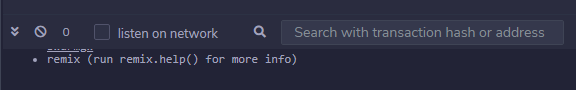
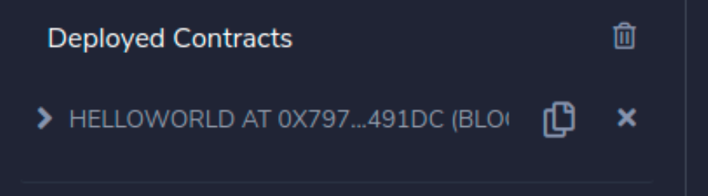

_This tutorial will show you step by step how to use Remix and Metamask to create and deploy a simple smart contract on Solana. Although the instructions use Solana's [Testnet](https://docs.solana.com/clusters#testnet), they may also be applicable to Solana's [Devnet](https://docs.solana.com/clusters#devnet) or Solana's [Mainnet Beta](https://docs.solana.com/clusters#mainnet-beta).

_本教程将逐步向您展示如何使用 Remix 和 Metamask 在 Solana 上创建和部署一个简单的智能合约。尽管这些说明在 Solana [测试网](https://docs.solana.com/clusters#testnet)([Testnet](https://docs.solana.com/clusters#testnet))环境中，但它们也可能适用于 Solana 的 [Devnet](https://docs.solana.com/clusters#devnet) 或[Mainnet Beta](https://docs.solana.com/clusters#mainnet-beta)。

##### 需求(Requirements)

Before you start, make sure of the following:

开始之前，请确保以下内容：

- MetaMask is installed on your device.  
   MetaMask已经安装成功。

- You have provided online access to remix.ethereum.org to use the `Remix - Ethereum IDE` open source web application.  
   您已提供 `remix.ethereum.org` 在线访问权限，来使用 `Remix - > Ethereum IDE` 开源 Web 应用。

- MetaMask is configured for both proxy and Neon EVM (regardless of how proxy and Neon EVM run, MetaMask wallet must always be configured for them).  
   MetaMask 已为代理 和Neon EVM 配置完成(无论代理和Neon EVM > 如何运行，必须始终为它们完成配置)。

The network configuration:  
(此外)网络的配置:  

- [Solana cluster](https://docs.solana.com/clusters) is accessed via a proxy.  
   [Solana集群](https://docs.solana.com/clusters)可以通过代理访问

- Solana works in test mode and the proxy interacts with it through Neon EVM.  
   Solana 在测试模式正常运行，代理通过 Neon EVM 与之交互。

#### 如何完成(Steps to complete)

##### 第1步：配置Remix环境 (Step 1. Set the Remix environment)

For Remix to be used to load a smart contract into Neon EVM, Remix must be connected to your MetaMask wallet and run in the `Injected Web3` environment.

要使用 Remix 将智能合约加载到 Neon EVM 中，Remix 必须连接到您的 MetaMask 钱包并在 `Injected Web3` 环境中运行。

Go to **http://remix.ethereum.org** and open the `Remix - Ethereum IDE` web application. In the left side menu, select `File explorers`. The `FILE EXPLOPERS` menu will be active (Fig. 1).

转到 **http://remix.ethereum.org/** 并打开 `Remix - Ethereum IDE Web` 应用。在左侧菜单中，选择`File explorers`。 `FILE EXPLOPERS` 菜单将被激活(图 1)。

(图1：连接localhost Connecting to localhost)

##### 第2步：在Remix创建一个简单的智能合约(Step 2. Create a simple smart contract at Remix)

Click on the icon `Create New File` and type the file name in the field that appears below it. For example helloWorld.sol

单击图标`Create New File`并在其下方字段输入入文件名。例如 helloWorld.sol

For now, it is an empty file. To fill it with content, click on the created file name and type the text on the right side of the explorer (or copy your pre-prepared text there)(Fig. 2).

目前，它是一个空文件。要填充内容，请单击创建的文件名并在资源管理器的右侧键入文本(或在那里复制您预先准备的文本)(图 2)。

 
 
 (图 2:加载“helloWorld”合约 Loading the helloWorld smart contract)

##### 第3步：编译智能合约(Step 3. Compile a smart contract)

In the left side menu select the `Solidity compiler`. The `SOLIDITY COMPILER` menu will be active.

在左侧菜单中选择 `Solidity compiler`。 `SOLIDITY COMPILER`菜单将被激活。

Click on the Compile helloWorld.sol button to compile the loaded smart contract helloWorld (Fig. 3).

点击 `Compile helloWorld.sol` 按钮编译加载的智能合约 helloWorld(图 3)。

  

(图3:编译“helloWorld”智能合约 Compiling helloWorld smart contract)

If the compilation is successful, a green icon will appear near the Solidity compiler button.

如果编译成功，`Solidity compiler`按钮附近会出现一个绿色图标。

You can also get detailed information about the compilation process by clicking Compilation Details (Fig. 4).

您还可以通过单击 Compilation Details(图 4)获取有关编译过程的详细信息。

  

(图4:编译详情 Compilation details)

##### 第4步：将Remix连接到MetaMask(Step 4. Connect Remix to MetaMask)

Interaction with Neon EVM is carried out through MetaMask. Choose the `Injected Web3` environment to connect Remix with an active account in Metamask (Fig. 5).

与 Neon EVM 的交互是通过 MetaMask 进行的。选择 `Injected Web3` 环境以将 Remix 与 Metamask 中的活动帐户连接起来(图 5)。

  

(图5:在metamask中用活跃账号连接 Injected Web3和Remix Injected Web3 connects Remix with an active account in Metamask)

The MetaMask window should appear. It should display a list of available accounts (in our case, only one account will be displayed). Choose this account and click `Next` (Fig. 6).

MetaMask 窗口应该出现。它应该显示可用帐户的列表(本例中只会显示一个帐户)。选择此帐户并单击`下一步(Next)` (图 6)。

  

(图6:选择一个账号来和Remix交互 Selecting an account to interact with Remix)

Click `Connect` to connect to this account (Fig. 7).
点击 `连接(Connect)`，连接到账户  

   

(图7)

##### 第5步：在Solana测试网上部署智能合约(Step 5. Deploy a smart contract in Solana Testnet)

In the left side menu, select `Deploy & run transactions`. The `DEPLOY & RUN TRANSACTIONS` menu will become active.

在左侧菜单中，选择`Deploy & run transactions`。`DEPLOY & RUN TRANSACTIONS` 菜单将变为活动状态。

In our case there is only one smart contract to deploy. Therefore, it is automatically selected from the dropdown and Remix will automatically generate a transaction.

在本例中，只有一个智能合约需要部署。因此，它会自动从下拉列表中选择，Remix 会自动生成交易。

The `Account` field will display the amount in the wallet account. This data is taken from MetaMask.

`Account` 字段将显示钱包账户中的金额。该数据取自 MetaMask。

Click `Deploy` (Fig. 8).

点击`Deploy` (Fig. 8).

  

(图8:部署智能合约 Deploying the smart contract)

MetaMask will send a notification in the form of a pop-up window to confirm the transaction. Click `Confirm` (Fig. 9).

MetaMask 会以弹窗的形式发送通知来确认交易。单击`确认(Confirm)` (图 9)。

  

(图9:MetaMask提示 MetaMask  notification)

Once the transaction is confirmed, you can check it in the messages on the bottom right (Fig. 10).

确认交易后，您可以在右下角的消息中查看(图 10)。

  

(图 10)

After successfully deploying the smart contract, you will see a message containing the name and address of the smart contract where it was uploaded (Fig. 11).

成功部署智能合约后，您会看到一条消息，其中包含上传智能合约的名称和地址(图 11)。

  
 

(图 11:已部署的智能合约数据 Deployed the smart contract data)

If all the steps have been completed successfully, a green icon will appear near the `Deploy & run transactions` button (Fig. 12).

如果所有步骤都成功完成，一个绿色图标将出现在 `Deploy & run transactions` 按钮附近(图 12)。

（图12:Remix界面最后审核页面 Final view of the Remix panel）

Congratulations! You can now call methods of the helloWorld smart contract deployed on the Solana network (Fig. 13 shows the result of your smart contract --- the text string "Hello World!").

恭喜！您现在可以调用部署在 Solana 网络上的 helloWorld 智能合约的方法了(图 13 显示了您的智能合约的结果------文本字符串"Hello World！")。

  

(图13:调用智能合约方法 Calling the smart contract methods)

>
>Useful links  
>参考连接  
>https://ethereum.org/en/developers/tutorials/deploying-your-first-smart-contract/