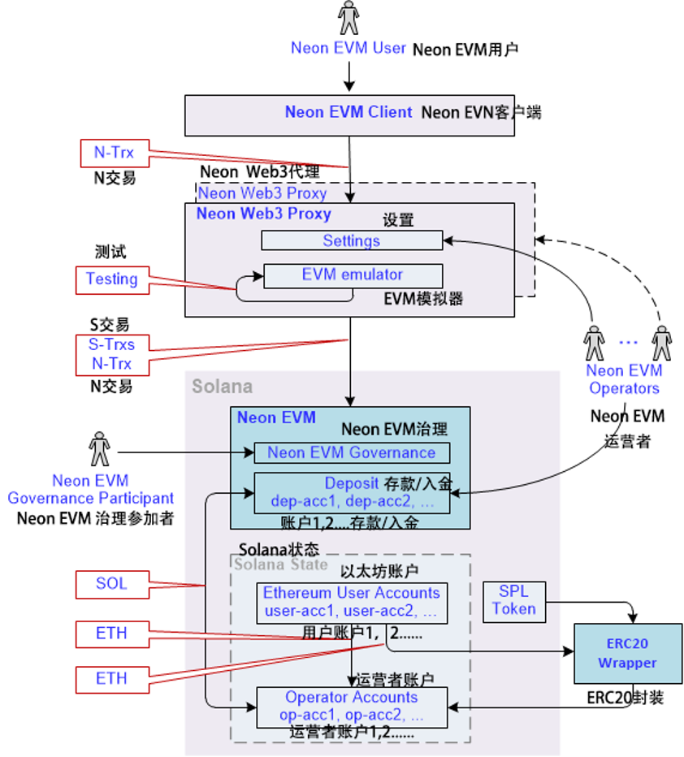
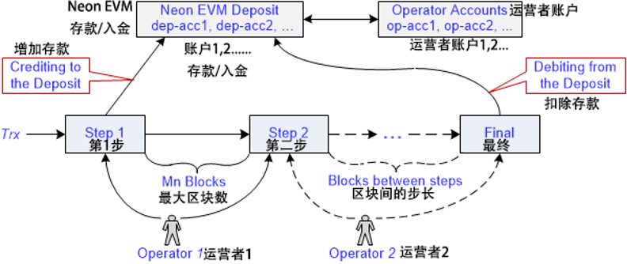
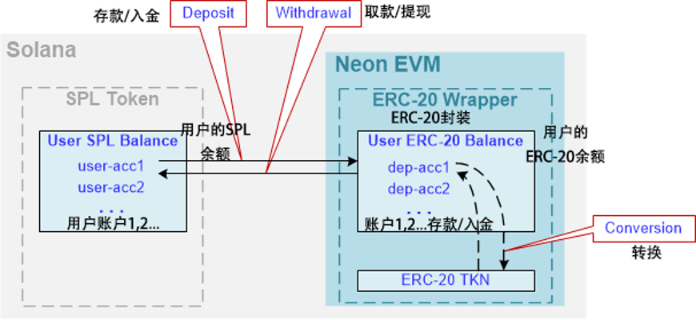
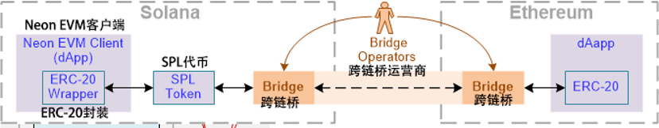

_This section describes the architectural solutions built into Neon EVM that enable fast transaction processing for Ethereum users. It also describes how tokens pass from users to final consumers._

_本节介绍 Neon EVM 中内置的架构解决方案，可为以太坊用户实现快速交易处理。它还描述了代币如何从用户传递到最终消费者。_

### 概述 (General)

For a user's transaction to be executed quickly, it must be finalized quickly. Therefore, the main task for Neon EVM developers is to ensure the prompt finalization of a transaction. Also, solutions should be developed to ensure the creation of liquid tokens by Neon EVM users, and their circulation within Solana.

只有快速确定最终状态，用户的交易才能快速执行。因此，Neon EVM 开发人员的主要任务是确保交易的及时完成。此外，应开发解决方案来保证Neon EVM 用户创建流动代币及其在 Solana 内的流通。

### 解决方案(Solution)

The architectural solution based on Neon EVM is presented in Fig. 1.  
基于 Neon EVM 的架构解决方案如图1所示：

    

(图 1）

  

The components of the architecture are:  
整个架构的各部分如下：

#### Neon EVM用户 (Neon EVM User ,user)

Any user who has an account in Neon EVM with a balance in ETH, ERC-20, or ERC-721 tokens.

任何拥有 Neon EVM 账户且余额为 ETH、ERC-20 或 ERC-721 代币的用户。

#### S交易 (Solana Transaction ,S-trx)

A transaction formed according to Solana network rules with a signature produced by Solana rules.

本身和签名都根据 Solana 网络规则生成的交易。

#### N交易 (Neon Transaction ,N-trx)

A transaction formed according to Ethereum rules with a signature produced by Ethereum rules.

本身和签名都由以太坊规则生成的交易。

#### 客户端 (Neon EVM Client , client)

An application that has an EVM (Solidity, Vyper, etc.) bytecode contract loaded into Neon EVM. The application generates a transaction N-trx according to Ethereum rules and sends it to a proxy. Before sending N-trx, the client transfers the required funds to the Solana deposit to cover the costs of an operator.

将 EVM(Solidity、Vyper 等)字节码合约加载到 Neon EVM 中的应用程序。它根据以太坊规则生成一笔N交易并将其发送到代理。在发送N交易之前，客户将所需资金划入 Solana 存款以支付运营方的费用。

#### 运营方/运营商(Neon EVM Operator ,operator)

A role performed by a Solana account using a software tool. Within Neon EVM, an operator is provided with software in the form of a proxy in order to fulfill certain functions. The operator can deploy one or more proxies. The operator can also configure one proxy for multiple operators, as well as run several proxies with different settings.

Solana 帐户使用软件工具担任的角色。在 Neon EVM 中，为运营方提供了代理形式的软件来实现某些功能。运营方可以部署一个或多个代理。一个运营方还可以为多个运营者配置同一个代理，也可运行设置相异的多个代理。

#### Neon代理 (Neon Web3 Proxy, proxy)

The software that an operator uses to do their job. Although the proxy is not a mandatory component in the Neon EVM architecture (for example, proxy logic can be implemented inside a client's browser), implementing it as a separate component can speed up transaction processing. In the Neon EVM mainnet, the proxy must provide multithreading to work in parallel.

运营方用来完成工作的软件。尽管代理不是 Neon EVM 架构中的必须组件(例如，代理逻辑可以在客户端的浏览器中实现)，但将其作为单独的组件实现可以加快交易处理速度。在 Neon EVM 主网中，代理必须提供(支持)多线程才能并行工作。

The proxy contains an EVM emulator that pre-tests the execution of the transaction. This testing determines the number of coins required on the operator's balance, as well as the current exchange rate of SOL to ETH. Each operator configures their proxy server with this course in mind. This relates to economic motivation.

代理包含一个 EVM 模拟器，用于预先测试交易的执行。该测试确定运营方余额满足(运营时)所需持有的代币数量，以及当前 SOL 与 ETH 的汇率。每个运营方在配置他们的代理服务器时都会考虑这些。这与经济动机(激励)有关。

A proxy converts N-trx into transactions under Solana rules. N-trx is signed by a user, while S-trxes are signed by an operator. The Neon transaction text is loaded from the received S-trexes into a separate account that is created in Solana. Neon EVM receives a command to execute the transaction located at the address of this account.

代理将N交易转换为 Solana 规则下的交易。N交易由用户签名，而S交易由运营方签名。Neon 交易文本从收到的S交易加载到在 Solana创建的单独帐户中。Neon EVM接收执行该帐户地址的交易命令。

More details on how the proxy converts a N-trx to multiple S-trxs can be found [here](https://neonlabsorg.medium.com/neon-web3-proxy-facilitating-seamless-transactions-on-neon-evm-b33c2041aa08).

可以在[此处](https://neonlabsorg.medium.com/neon-web3-proxy-facilitating-seamless-transactions-on-neon-evm-b33c2041aa08)找到有关代理如何将 N-trx 转换为多个 S-trx 的更多详细信息。

Below is a list of the main Neon Web3 Proxy features that are implemented in the Neon EVM Testnet:

以下是 Neon EVM 测试网中实现的主要 Neon Web3 代理功能列表：

- Receiving requests over Web3 API protocol  
   通过 Web3 API 协议接收请求

- Shaping responses using Web3 API protocol  
   使用 Web3 API 协议塑造(编辑)响应

- Packaging a Neon transaction into a Solana transaction. The Solana transaction contains the following information:  
   将 Neon 交易打包到 Solana 交易中，包含的信息有：
    - The Neon EVM operator account that the amount in SOL tokens should be withdrawn from for execution  
       Neon EVM 运营方帐户因执行(交易)而应提取的 SOL 代币金额
    
    - The Neon EVM operator account where a payment is sent for the job done in tokens specified by the user  
      Neon EVM 运营方因完成用户指定代币的工作而用来付款的帐户
      
    - The Neon EVM account to deposit funds to be spent for iterative execution of a transaction  
       存放用于迭代执行交易之资金的Neon EVM账户
    - A list of accounts that are participating in the execution of Neon transactions (formed according to Solana rules)  
       参与执行Neon交易的账户列表(根据 Solana 规则形成)
    - The number of steps per iteration of a Neon transaction  
       Neon交易每次迭代的步长

- Executing read-only Solidity methods of contracts  
   执行只读Solidity方法的合约

- Providing a method for linking accounts from SPL token contracts to ERC-20: an SPL wrapper to access SPL token contracts via Neon transactions  
   提供一种将账户从 SPL 代币合约链接到 ERC-20 的方法：通过 Neon 交易访问 SPL 代币合约的 SPL 封装器

- Giving users a method to switch a token to be used for gas payment  
   为用户提供一种切换代币类型来支付gas费用的方法

- Giving users a method to execute an Neon transaction without a test run.    
   为用户提供无需试运行即可执行 Neon 交易的方法。

#### Neon EVM

An Ethereum Virtual Machine compiled into the Berkeley Packet Filter bytecode of a virtual machine running on Solana. Neon EVM is configured using a multisig EVM account that resembles a decentralized Neon EVM governance. Participants of the multisig EVM account (actors) can change the Neon EVM code and set up Neon EVM parameters.

一个以太坊虚拟机编译成运行在 Solana 上虚拟机的伯克利包过滤器字节码。Neon EVM 使用类去中心化 Neon EVM 治理的多重签名 EVM 帐户进行配置。多重签名 EVM 帐户的参与者(活动者)可以更改 Neon EVM 代码并设置 Neon EVM 参数。

#### Neon EVM治理参与者(Neon EVM Governance Participant)

Governance participants perform the following functions:  
治理参与者运作以下职能：

- Updating contracts  
   更新合约

- Adding functionality  
   添加新功能

- Eliminating shortcomings in the program code  
   消除程序代码中的缺陷

- Changing settings parameters such as the fee value, opening a new balance, the Mn value, the maximum number of iterations, etc.  
   更改参数，例如费用值、开立新余额、Mn值、最大迭代次数等。

#### ERC-20 TKN

This is a contract based on the ERC-20 standard token. An ERC-20 token shows user balances for a certain ticker. After an account (user-acc) selects a type of token, this contract becomes blocked.

这是一个基于 ERC-20 标准代币的合约。 ERC-20 代币显示特定(交易)代号的用户余额。在一个账户(user-acc)选择了一种代币后，这个合约就被封锁了。

#### SPL代币(SPL Token)

Solana Program library (SPL) token is a contract that contains a system register of tokens that are in the system, along with the Solana balances of their users. The contract implements the ERC-20 interface; this is a description of the basic set of functions that the contract must support. Transferring funds is possible only with a contract that supports this operation.

Solana 程序库 (SPL) 代币是一种包含一个系统代币注册器和用户对应Solana余额的合约。合约实现了ERC-20接口；这是对合约必须支持的基本功能集的描述。只有通过支持此操作的合约才能转移资金。

#### Solana

This is a blockchain containing a stream of blocks. It stores a block-log of completed operations. It also contains the current Solana state, where the results of transactions, accounts, and public keys are stored. There are also two balances: one for ETH tokens, and another for the token that the transaction will be paid in.

这是一个包含区块流的区块链。它存储已完成操作的区块日志。它还包含当前 Solana 状态，其中存储了交易的结果、帐户和公钥。此外还有两个余额：一个用于 ETH 代币，另一个用于支付交易的代币。

#### ERC-20封装器(ERC-20 Wrapper)

This is a separate contract developed using the ERC20 standard. It contains maps with user balances. Although this contract is hosted inside Neon EVM, it is completely standalone and independent.

这是一个使用 ERC20 标准开发的单独合约。它包含带有用户余额的映射。尽管该合约托管在 Neon EVM 中，但它是完全独立的。

A user can create a contract supporting the ERC20 standard for a specific token and generate the required number of tokens (coins). These tokens will only be liquid within Neon EVM. For these coins to be liquid in Solana, the SPL Token and ERC-20 TKN contracts must be interoperable. This function is performed by the ERC-20 Wrapper contract.

用户可以为特定代币创建支持 ERC20 标准的合约，并生成所需数量的代币。这些代币将仅能在 Neon EVM 中流动。为了使这些代币在 Solana 中也具有流动性，SPL 代币和 ERC-20 TKN合约必须是可交互的。此功能由 ERC-20 Wrapper 合约执行。

### 用经济学激励运营方(Using Economics to Motivate Operators)

Conventionally, the processing of a transaction is divided into several steps (iterations). The number of steps may vary depending on the number of operations required to complete the transaction. The next step starts only after the previous step has been successfully completed (Fig. 2).

常规来说，交易的处理分为几个步骤(迭代)。步骤的数量可能会根据完成交易所需的操作数量而有所不同。只有在上一步成功完成后才开始下一步(串行)，如图2所示：

  

(图 2)

  

A transaction is considered to be successfully completed if the "Final" step finishes. The execution of the transaction should not go beyond the allotted number of Mn blocks. In other words, the operations performed at all steps must be completed within the Mn period, or the transaction is considered incomplete.

如果“Final(最终)”步骤完成，一般就认为交易成功完成了。交易的执行不应超过分配的 Mn 块数。换句话说，所有步骤的执行操作都必须在 Mn 周期内完成，否则该交易被认为是不完整(未完成)的。

A user who forms a transaction will indicate an operator (proxy) within it. That operator will be responsible for the execution of the transaction. Each operator has a deposit account in Neon EVM. These accounts belong to Neon EVM, so no one can withdraw funds from the deposit account until the finalization step has been completed. Before processing a transaction, Neon EVM debits the funds from the operator account (op-acc) and transfers them to the operator's deposit account (dep-acc).

形成(发起)交易的用户将在(交易中)指明运营方(代理)。该运营方将负责交易的执行。每个运营方在 Neon EVM 中都有一个存款账户。这些账户属于 Neon EVM，因此在完成最终步骤之前，任何人都不能从存款账户中提取资金。在处理交易之前，Neon EVM 从运营方账户 (op-acc) 中扣除资金并将其转入运营方的存款账户 (dep-acc)。

If for any reason (such as lack of funds), an operation is not performed at a given step, the next operator starts processing the transaction from the current step. This operator does not deposit any funds for the remaining steps. If they also do not complete all of the remaining steps, this process is passed to the next operator. At the "Final" step, a transaction is created that withdraws funds from the deposit in full and credits them to the operator who completed this last step. This method of implementation moivates not only the client, but also any operator involved in processing the transaction to have a vested interest in making sure that the transaction is successfully completed.

如果由于任何原因(例如资金不足)，在指定步骤未执行操作，则下一个运营方就会从当前步骤开始处理交易。该运营方不会为剩余步骤注入任何资金。如果他们也没有完成所有剩余步骤，则此过程将传递给下一个运营方。在“最终”步骤，一个从存款中全额提取资金，并将其存入运营方来完成最后一步的交易将被创建。这种实施方法不仅激励客户(端)，而且激励参与处理交易的任何运营方，有足够的既得利益来确保交易完成。

Example:  
举例:  

Step 1: transferring funds to a deposit.  
第 1 步：将资金转入存款。

Step 2: blocking an account.  
第 2 步：封闭/锁住一个帐户。

Additional Steps: other actions.  
附加步骤：其他动作。

Final Step: the deposit is returned to the operator's account (op acc). The results of the transaction have already been reflected in the Solana state.

最后一步：押金退回到运营方的账户(op acc)。交易结果已经反映在 Solana 状态中。

In the Neon EVM settings, there is a limit on the number of blocks (Mn) that can be processed during a transaction. By default, the Mn value is 1. that is, a transaction must be completed during the processing of one block. There is also a limit on the number of steps (iterations) that can be taken to complete a transaction. The Mn value and the number of iterations are set by a multisig account. The number of steps is also limited by a user’s fund balance.

在 Neon EVM 设置中，交易期间可以处理的块数 (Mn) 有限制。Mn 值默认为 1，即在处理一个块的过程中必须完成一笔交易。完成交易可以采取的步骤(迭代)数量也有限制。Mn 值和迭代次数由多重签名帐户设置。步数也受用户资金余额的限制。

At every step, the "Continue" operation checks whether or not this is the last step in the transaction execution.

"继续 (Continue)”操作会在每一步都检查这是否是交易执行的最后一步。

#### 运营方如何发现已准备好继续进行的交易?(How can operators find out about the transactions that are ready to be continued?)

Solana's entire history is stored in the Solana state. Using this history, the operator can obtain the necessary information about all transactions related to Neon EVM. The proxy can track incomplete transactions in this history: transactions that can be continued by another operator. The operator who wishes to continue executing the unfinished transaction must first re-sign it with their key. If the number of blocks does not exceed Mn since processing was initiated by the previous operator, the signature of the initial operator is kept. If the number of blocks exceeds Mn, the transaction can be re-signed by any operator.

Solana 的整个历史都存储在 Solana 状态中。使用此历史记录，运营方可以获得与 Neon EVM 相关所有交易的必要信息。代理可以跟踪历史中不完整的交易，即可以由另一个运营方继续的交易。希望继续执行未完成交易的运营方必须首先用他们的密钥重新签名。如果从前一个运营方启动处理时到当前的块数不超过 Mn，则保留初始运营方的签名。如果块数超过 Mn，则交易可以由任何运营方重新签名。

#### 特例(Special Cases)

Case 1: one of the initial and mandatory operations is blocking an account. That is, the execution of other transactions is blocked for an amount of time.  
特例 1：初始和强制操作之一是封闭帐户。即其他交易的执行被阻塞了一段时间。

If an operator is interested in reducing this amount of time, they must complete a transaction in Mn blocks, otherwise another operator will perform this transaction.

如果一个运营方有兴趣减少这个时间量，他们必须在 Mn 个块中完成一个交易，否则另一个运营方将执行这个交易。

For example (see Fig. 2), to go from Step 1 to Step 2), Operator 1 must process Mn blocks. During this time, the "Continue" operation will not be available to other operators. If Operator 1 is unable to complete a transaction during the processing of Mn blocks, this transaction remains incomplete. The funds on the balance are burned out.

Therefore, it is in every operator’s best interest to use high-speed resources.

例如(见图 2)，要从步骤 1 转到步骤 2)，运营方1 必须处理 Mn 个块。在此期间，其他运营方将无法使用“继续”操作。如果运营方1 在处理 Mn 个块的过程中无法完成一笔交易，则该笔交易仍然是不完整的。余额中的资金被“烧”光了。因此，使用高速资源符合每个运营方的最大利益。

Case 2: a transaction cannot be completed if an error occurs.  
特例 2：如果发生错误，则无法完成交易。

If Step 1 is completed, and "Cancel" occurred in Step 2, the funds are not returned to the operator. Funds cannot be withdrawn from a client for the partial execution of a transaction. The funds are also not returned to the client. In this case, the funds on the deposit will be burned. To avoid losing funds, the operator is compelled to complete the transaction in full, not in part.

如果步骤 1 完成，并且在步骤 2 中发生“取消”，则资金不会退还给运营方。部分执行是不能从客户端提现的。资金也不会退还给客户端。在这种情况下，存入的资金将被烧毁。为了避免损失资金，运营方会被迫完整执行交易，而不是部分完成。

Case 3: Insufficient funds.  
特例 3：资金不足。

Before executing a transaction, two things are checked: the user’s account balance , and whether the gas limit will be exceeded. If there is a shortage of funds during any of the steps, the transaction is labelled as "Fail" and funds are debited from the user's account and transferred to the operator's account.

在执行交易之前，两件事会被检查：用户的账户余额，以及是否会超过 gas上线。如果在任何一个步骤中出现资金短缺，交易将被标记为“失败”，资金将从用户账户中扣除并转入运营方账户。

### Solana内部代币转账(Transferring Tokens Inside Solana)

The ERC-20 wrapper, a special dApp (contract) with token balances, has been created. Application users know the address of this dApp. To transfer funds, they need to contact this dApp address and specify an account and the amount of funds to transfer. The transfer will take place within this contract.

ERC-20封装器，一个含有代币余额的特殊 dApp(合约)，已经被创建。应用的用户知道这个 dApp 的地址。要转移资金，他们需要联系这个 dApp 的地址，并指定一个帐户和转移的资金规模。转移将在这个合约内进行。

The interaction between the SPL token and ERC-20 TKN is shown in Fig.3.

SPL 代币与 ERC-20 TKN 之间的交互如图3所示。

  

图 3

There are two user balances:  
有两个用户余额：

- User SPL Balance, whose tokens are traded within Solana.  
   在 Solana 内交易的用户 SPL 余额，。

- User ERC20 Balance, whose tokens are traded within Neon EVM.  
   在 Neon EVM 内交易的用户 ERC20 余额

The ERC-20 wrapper allows users to transfer their SPL tokens on the ERC-20 Balance, exchange them for tokens they need, and withdraw them back. Thus, a user can create a token inside Neon EVM and transfer any number of coins from User SPL Balance to User ERC-20 Balance. Then, using EVM contracts, they can use these coins.

ERC-20 封装器允许用户在 ERC-20 余额上转移他们的 SPL 代币，将其兑换成他们需要的代币，然后将其取回。因此，用户可以在 Neon EVM 中创建一个代币，并将任意数量的代从用户 SPL 余额转移到用户 ERC-20 余额。然后，使用 EVM 合约，他们可以使用这些硬币。

#### 支付队列(Payment Queues)

**问题(The Issue)**

If the ERC-20 TKN contract contains only one map for all users and their balances, it can result in an issue: if the majority of users pay with ETH tokens, then the same contract will appear inside each N-trx, where the value will need to be changed.

如果 ERC-20 TKN 合约只包含一个所有用户及其余额的映射，则可能会导致一个问题：如果大多数用户使用 ETH 代币支付，那么相同的合约将出现在数额需要变化的每个N交易中。

This will cause all N-trxes to line up “single file” and they cannot be executed in parallel.This is because at the final step, the funds would be transferred from the user's balance to the operator's balance within one contract.

这将导致所有N交易排成“单个文件”且无法并行执行。这是因为在最后一步，资金将在一个合约内从用户的余额转移到运营方的余额。

**解决方案(The Solution)**

The default token type field is added to the Neon account along with the balance. This field provides a special option that will allow a user to select a type of token for payment. The ERC-20 wrapper can be used to transfer SPL tokens from outside to an operator's account.

默认代币类型字段与余额被一起添加到了 Neon 帐户。该字段提供了一个特殊选项，允许用户选择某种代币进行支付。 ERC-20 封装器可用于将 SPL 代币从外部转移到运营方的账户。

The Neon client does not have an option to select a type of token for payment, and can only operate with ETH. Therefore, the storage of funds is implemented in the user's Solana state. The Neon account (user-acc) has a separate field that specifies the type of token. After a user specifies a type of token, this type will be indicated in the account field of this user. Having this information, Solana can use the ERC-20 wrapper to convert tokens.

Neon 客户端没有选择支付代币类型的选项，只能使用 ETH 操作。因此，资金的存储是在用户的 Solana 状态下实现的。Neon 帐户 (user-acc) 有一个单独的字段，用于指定代币的类型。用户指定代币类型后，该类型将在该用户的帐户字段中表明。有了这些信息，Solana 就可以使用 ERC-20 封装器来转换代币。

An operator creates a deposit account for the transaction. It is possible to create a pool of such deposit accounts so that the ERC-20 wrapper logic will select the desired transaction from this pool rather than creating a queue for the payment of funds to the operator.

运营方为交易创建一个存款账户。以下方法是可行的：创建一个此类存款账户池，从而让ERC-20 封装器逻辑从该池中选择所需的交易，而不是创建一个用于向运营方支付资金的队列。

### Solana和ETH互相转账(Transferring tokens between Solana and Ethereum)

The ERC-20 wrapper allows users to manipulate balances inside SPL tokens. The user runs an application inside Neon EVM with logic that releases new coins. To transfer these coins to the outside world, they need to use the ERC-20 bridge implementation. Inside Neon EVM, these coins will be blocked and transferred inside the SPL token to different addresses. They will become liquid inside Solana, but under a different token name, which is registered inside Solana.

ERC-20 封装器允许用户调整 SPL 代币内的余额。用户在 Neon EVM 中运行一个逻辑是发布新币应用。若要将这些硬币转移到外部，他们需要使用 ERC-20 跨链桥实现。在 Neon EVM 内部，这些硬币将在 SPL 代币中被封锁并转移到不同的地址。它们将在 Solana 内部流通，但使用在 Solana 内部注册的另外名称。

A user also can transfer part of the funds to their balance inside Neon EVM and convert it into a new token using a token exchange algorithm of their choice.

用户还可以将部分资金转移到他们在 Neon EVM 中的余额中，并使用他们选择的代币交换算法将其转换为新的代币。

Fig. 4 shows the process for transferring tokens between Solana and Ethereum.

图 4 显示了在 Solana 和以太坊之间转移代币的过程。

  

(图 4)

Ethereum tokens are generated in accordance with the ERC-20 standard. Therefore, to transfer tokens between the Solana and Ethereum blockchains, a separate ERC-20 wrapper must be deployed for each Solana token. The ERC-20 wrapper’s job is to ensure that the Solana applications interact with EVM (Solidity, Vyper, etc.) bytecode contracts, as well as to transfer funds in Solana tokens using Ethereum wallets such as MetaMask.

以太坊代币是根据 ERC-20 标准生成的。因此，要在 Solana 和 Ethereum 区块链之间转移代币，必须为每个 Solana 代币部署单独的 ERC-20 封装器。 ERC-20 封装器的工作是确保 Solana 应用程序与 EVM(Solidity、Vyper 等)字节码合约交互，以及使用 MetaMask 等以太坊钱包以 Solana 代币转移资金。

The main interacting component in the token transfer is the ERC-20 bridge, which is a separate contract. When it’s called, it generates a Solana token, which represents the corresponding ERC-20 token in the SPL token contract. The Solana tokens registered in the SPL token contract can be transferred to Solana contracts.

代币转移中的主要交互组件是 ERC-20 跨链桥，它是一个单独的合约。当它被调用时，它会生成一个 Solana 代币，它代表了 SPL 代币合约中对应的 ERC-20 代币。在 SPL 代币合约中注册的 Solana 代币可以转移到 Solana 合约中。

Bridge operators are responsible for the ERC-20 bridge operation. They get fees from the conversion of tokens.

跨链桥运营方负责 ERC-20 跨链桥的运营。他们从代币转换中获得费用。