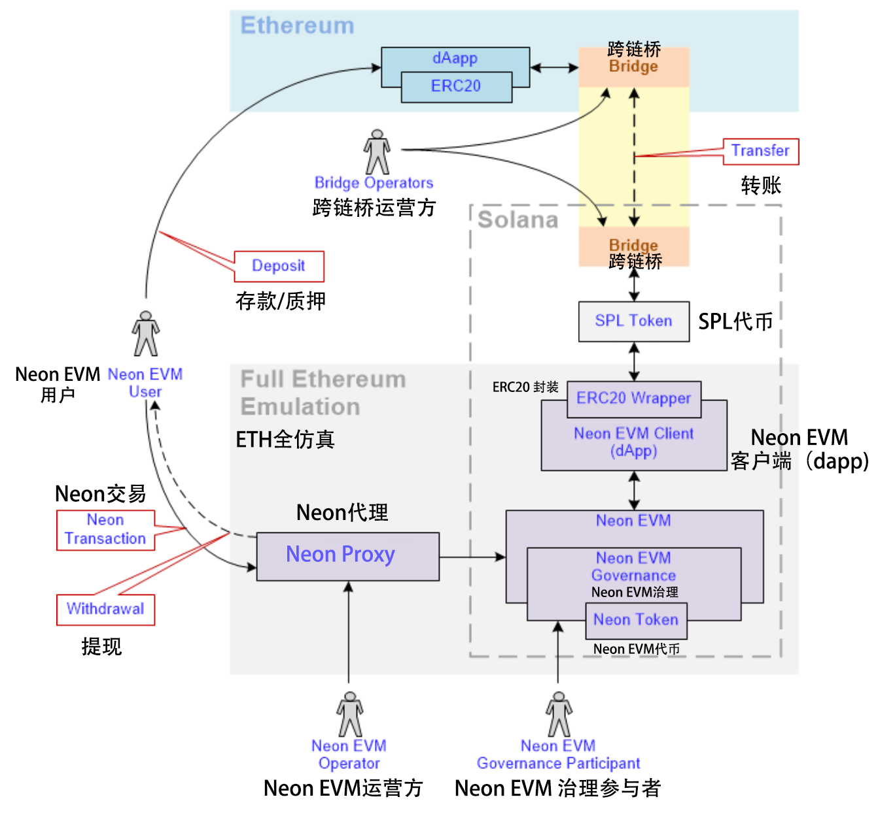

——_***Neon EVM : 
用Solana扩展以太坊智能合约***_

 

## 版权声明(Copyright Notice)

本文翻译自[Neon EVM](https://neon-labs.org/)项目的[白皮书](https://neon-labs.org/Neon_EVM.pdf)，并已得到授权。译者为[@chainguys](https://twitter.com/Chainguys)。转载请注明作者和译者。
(Coptyright©2021 by [Neon Labs](https://neon-labs.org/) , translated by [@chainguys](https://twitter.com/Chainguys))

本文所展示的一切信息都只是为了学习和交流目的，不能也不应成为任何财务或投资建议。
(All content shown are for communication and learning purposes, cannot and should not be viewed as any form of Financial or Investment Advice)

## 欢迎词(Hello World)

Neon EVM is an Ethereum virtual machine on Solana that enables dApp developers to use Ethereum tooling to scale and get access to liquidity on Solana.

Neon EVM是Solana上的以太坊虚拟机(EVM),它让去中心化应用(dapp)的开发者可以用以太坊的工具在Solana上扩展并且获得流动性。

## 概述(Abstract)

Ethereum remains the dominant blockchain protocol linked to smart contract trading and settlement. Its infrastructure for dApp developers and end-users is the most advanced.

以太坊依然是智能合约交易与清算相关的主要区块链协议。对dApp开发人员和最终用户来说，它的基础设施是最先进的。

This paper introduces Neon EVM: a tool that allows for Ethereum-like transactions to be processed on Solana, taking full advantage of the functionality native to Solana, including parallel execution of transactions. As such, Neon EVM allows dApps to operate with the low gas fees, high transaction speed, and high throughput of Solana, as well as offering access to the growing Solana market.

本文将介绍 Neon EVM：一种在Solana上处理类以太坊交易的工具，(它)充分利用Solana交易并行执行等原生功能。如此，Neon EVM使得dApp能以Solana的低gas、高交易速度和大吞吐量运行，并提供进入不断成长的Solana市场(生态)的机会。

The Ethereum state is represented by Merkle-Patricia Trie that stores key-value data for all smart contracts, and smart contracts written in Solidity do not have separate references to shared data and contracts’ code. Therefore, these smart contracts have to be executed in sequence to ensure deterministic behavior. This limits a throughput: highly optimized blockchains with EVM are capable of processing up to a maximum of 1,500 TPS.

以太坊状态由存储所有智能合约键值数据的MPT(Merkle-Patricia Trie)表示，而用Solidity编写的智能合约并无对共享数据及合约代码的单独引用。因此，这些智能合约必须按顺序执行以保证行为的确定性。这样一来，链上的吞吐量就被限制了：高度优化的EVM区块链能购达到的(吞吐量)最多1,500 TPS。

However, Solana is designed to support massive scaling of decentralized applications, with a maximum throughput of more than 50,000 TPS. To take full advantage of Solana's functionality, Neon EVM is built as a smart contract of Solana. This also ensures flexibility in terms of updates: Neon EVM can be updated easily when new Ethereum functionality appears.

但是，Solana为了去中心化应用程序的大规模扩展而设计，最大吞吐量超过了50,000 TPS。为了充分利用Solan的功能，Neon EVM作为Solana的智能合约应运而生。这也确保了更新方面的灵活性：当新的以太坊功能出现时，Neon EVM(也)可以轻松更新。

In the case of Neon EVM, an intermediary proxy server that can be run by anybody wraps up Ethereum-like transactions into Solana transactions and sends them to Neon EVM that executes them in parallel. To ensure the parallel execution of smart contracts, Neon EVM implements several strategies. In particular, each contract keeps its data in its own Solana storage and account balances used to pay for Neon transactions are also separated.

在Neon EVM中，任何人都可以运行的中间代理服务器将类以太坊的交易打包到Solana交易中，并将它们发送到并行执行它们的Neon EVM。为了确保智能合约(能)并行执行，Neon EVM采取了多种策略。特别来说，每个合约都将其数据保存在各自的Solana存储中，而用于支付Neon交易的账户，余额也是分开的。

The solution allows any Ethereum application to be run on Solana without any changes to its codebase, including UniSwap, SushiSwap, 0x, and MakerDAO. All key tools for Ethereum dApps can work on Solana, including Solidity, Metamask, Remix, Truffle, and others.

该解决方案允许任何以太坊应用在Solana上运行，而无需更改其代码库，包括 UniSwap、SushiSwap、0x 和 Maker DAO。以太坊dApp的所有关键工具(也)都可以在Solana上运行，包括 Solidity、Metamask、Remix、Truffle等。

Neon EVM is best suited to developers that want to enjoy a first-mover advantage and reach new customers on Solana, or those who want to scale with the low gas fees and high throughput that Solana provides. It is also good for those developers who are looking to tap into liquidity on Solana.

希望在Solana上享受先发优势并接触新用户的开发人员是最适合Neon EVM的。或者是希望通过Solana低gas费用和高吞吐量进行扩展的开发人员。对那些希望在Solana上挖掘流动性的开发人员来说，也很不错。

## 导言(Introduction)

Ethereum is set to remain among the booming blockchain ecosystems. The number of active dApps on Ethereum is hovering above 300 and the number of active users of these dApps is close to 6 million, with the number of transactions on the rise. Ethereum’s popularity is not only down to its processing of smart contracts, but also thanks to its sophisticated infrastructure for application development.

以太坊肯定会继续留在蓬勃发展的区块链生态系统中。以太坊上活跃的 dApp 数一直保持在300以上，并且这些dApp的活跃用户数接近600万，交易量也呈上升趋势。以太坊的流行不仅归功于其对智能合约的处理，它用于应用开发的复杂基础设施也有功劳。

Solana is one of the most technically advanced blockchains, offering low gas fees and high throughput of transactions due to its technological innovations. Among these innovations is its Proof-of-Stake consensus system that is reinforced via a Proof-of-History protocol, a transaction parallelization technology that optimizes resources and ensures that Solana can scale horizontally across GPUs and SSDs, along with an optimized mempool system that speeds up throughput.

Solana是技术最先进的区块链之一，得益于技术创新，它能提供低gas费和高交易吞吐量。这些创新包括其股权/质押证明共识系统，该系统通过历史证明协议得到加强，这是一种交易并行化技术，与加快吞吐量的优化内存池系统一起，可以充分利用资源并使得Solana可以跨GPU和SSD 来进行水平(横向)扩展。

Neon EVM is a cross-chain solution that allows dApp developers to access the advantages of Solana and thus expand their services: to offer new products like arbitrage or high-frequency trading, grow their user base, and decrease costs where possible, including gas fees. It enables full compatibility with Ethereum on Solana.

Neon EVM是一种跨链解决方案，允许dApp开发人员利用Solana的优势来扩展他们的服务：提供套利或高频交易等新产品，扩大用户基数，同时尽可能降低成本，包括gas费。它使得Solana与以太坊完全兼容。

## Neon EVM基础信息(Neon EVM Fundamentals)

Solana blockchain has its own [Berkeley Packet Filter virtual machine(BPF virtual machine)](https://en.wikipedia.org/wiki/Berkeley_Packet_Filter). This virtual machine is used in the Linux kernel and has already been tested through time. BPF bytecode was originally designed for fast execution. Solana supports just-in-time compilation for BPF bytecode , which significantly increases the speed of execution of BPF contracts. Neon EVM is written in Rust and compiled to BPF bytecode. This allows us to take full advantage of Solana functionality, including parallel execution of transactions. It also makes it easy to update Neon EVM regardless of Solana’s hard forks.

Solana拥有自己的[Berkeley Packet Filter虚拟机(BPF虚拟机)](https://en.wikipedia.org/wiki/Berkeley_Packet_Filter)。该虚拟机用于Linux kernel，并且早已经受住了时间的“考验”。BPF字节码最初是为快速执行而设计的。Solana支持对[BPF字节码即时编译](https://en.wikipedia.org/wiki/Just-in-time_compilation)，显着提高了BPF合约的执行速度。Neon EVM用Rust编写并编译为BPF字节码。这使我们能够充分利用包括交易并行执行的Solana功能。无论Solana如何硬分叉，Neon EVM都可以轻松更新。

Let’s take a deeper look at the technical solution that Neon EVM offers.

让我们深入了解一下Neon EVM提供的技术解决方案。

#### Neon EVM 架构(Neon EVM Architecture)

Technical definitions(技术定义):

- **Neon EVM** is an Ethereum Virtual Machine compiled into Berkeley Packet Filter bytecode of a virtual machine running on Solana.
   **Neon EVM**是编译成伯克利包过滤器(Berkeley Packet Filter)的以太坊虚拟机，在Solana上运行时的虚拟机字节码。

- **Neon EVM user** is any user who has an account in Neon EVM with a balance in ETH, ERC20, and ERC721 tokens.
   Neon EVM用户是任何拥有Neon EVM账户且拥有ETH余额，ERC20和ERC721代币的用户。

- **Neon EVM client** is any application that has an EVM(Solidity/Vyper/etc.) bytecodecontract loaded into the Neon EVM on Solana.
   **Neon EVM客户端**是任何具有EVM(Solidity/Vyper/或其他)字节码合约的，加载到Solana上的Neon EVM应用。

- **Neon EVM operator** is any Solana account that pays for the execution of a Neontransaction in SOL tokens and receives payment for this work from the Neon EVM user in an arbitrary token specified by the user.
   **Neon EVM运营方**是任何用SOL代币支付执行Neon交易费用的，并以Neon EVM用户指定的任意代币从用户那里接收回款的Solana账户。

- **Neon EVM governance** is a decentralized Neon EVM governance that manages Neon EVM work by setting up Neon EVM parameters and updating Neon EVM software; it gets fees for its services.
   Neon EVM治理是一种去中心化的Neon EVM治理，通过设置Neon EVM参数和更新Neon EVM软件来管理Neon EVM 工作，并且服务是收费的。

- **Neon Proxy**  is a tool that can be used by a Neon EVM operator to package a Neon transaction into a Solana transaction.
   **Neon代理** 是一款可供Neon EVM运营方用来将Neon交易打包成Solana交易的工具。

- **Neon Transaction** is a transaction formed according to Ethereum rules with a signature produced by Ethereum rules.
   **Neon交易**是根据以太坊规则形成的交易，其签名由以太坊规则生成。

- **Bridge** is an EVM third-party(independent from Neon) solution with its own operators.
   **跨链桥**是一个拥有自己运营方的EVM第三方(独立于Neon)解决方案。

Neon EVM has the following functions:

Neon EVM有以下功能：

- Uploading EVM contracts(built by Solidity/Vyper compilers) to individual Solana accounts.
   将EVM合约(由 Solidity/Vyper编译器构建)上传到各个 Solana帐户。

- Checking signatures according to Ethereum rules on Solana.
   根据以太坊规则在 Solana 上检查签名。

- Executing Neon transactions, including, if necessary, in an iterative manner taking into account Solana resource constraints with the financial guarantees for completion of transactions.
   执行Neon交易，包含在必要时考虑Solana资源限制与财务担保，以迭代方式来完成交易
- Calculating gas consumption according to Ethereum rules.
   根据以太坊规则计算gas消耗。

- Receiving a payment from the user to Neon EVM operator for the gas consumed and fees in any ETH or any ERC-20 token specified by the user.
   接收用户向Neon EVM运营方支付的，消耗掉的gas，和用户指定的任何ETH或ERC-20代币的费用。
   
- Calculating and withdrawing fees in SOL tokens to the governance pool of Neon EVM from the Neon EVM operator account for execution of Neon transactions.
   从来自Neon EVM运营方，用于执行Neon交易的账户中，计算并提取费用(以SOL计价)到Neon EVM的治理池中。

- Storing EVM data of contracts in the form of a hash table using the [Hash Array Mapped Trie algorithm(HAMT)](https://en.wikipedia.org/wiki/Hash_array_mapped_trie).
   用 [Hash Array Mapped Trie algorithm(HAMT)](https://en.wikipedia.org/wiki/Hash_array_mapped_trie)生成的哈希表来存储智能合约的EVM数据。

## Neon 代理(Neon Proxy)

Neon Proxy is a service that provides a Web3 API to access the Solana blockchain. It is an intermediary for communication between Neon EVM clients and Neon EVM and it can be run by Neon EVM operators. Neon  Proxy is optional for any Neon EVM client. Its main functionality is to help Neon EVM clients start using Neon EVM without any changes to their codebase.

Neon代理是一项提供 Web3 API来访问Solana区块链的服务。它是Neon EVM客户端和Neon EVM之间的通信中介，它可以由Neon EVM运营方运行。Neon代理对于任何Neon EVM的客户端都是可选的。它的主要功能是帮助Neon EVM客户端无需更改其代码库就能使用Neon EVM。

#### ERC20 SPL封装器(ERC20 SPL-Wrapper)

For each Solana token, an ERC20 SPL-Wrapper contract can be deployed. The task of the ERC20 SPL-Wrapper is to ensure the interaction of the Solana applications with EVM(Solidity/Vyper/etc.) bytecode contracts. ERC20 SPL-Wrapper can be also used to transfer funds in Solana tokens using Ethereum wallets such as Metamask.

针对每种Solana代币，都可以部署一个ERC20 SPL封装合约。该合约的任务是确保Solana应用与EVM(Solidity/Vyper/等)字节码合约的交互。ERC20 SPL封装还可用于使用Metamask等以太坊钱包转账Solana代币。

## 用Neon EVM实现独立运营(Independence of Operations Within Neon EVM)

Neon EVM ensures the independence of its operations by providing open access to its infrastructure to anybody who is willing and capable of running Neon  Proxy. Moreover, Neon Web 3 Proxy can be replaced with a client library by any Neon EVM client. The transactions received by Neon EVM cannot be discriminated against because they do not have any attributes that determine their priority. The unchangeable nonce and user signature fields verified by Neon EVM guarantee the consistency of execution of Neon transactions and protect from re-execution.

Neon EVM通过向愿意并有能力运行Neon代理的任何人开放其对基础设施的访问，来确保运营的独立性。此外，任何Neon EVM客户端都可以将Neon Web 3代理替换为客户端库。Neon EVM收到的交易不会被特殊对待，因为它们没有任何属性来决定它们的优先级。Neon EVM验证的不可更改的随机数和用户签名字段保证了Neon交易执行的一致性，并防止重复执行。

## 执行Neon交易的前置条件(Preconditions for the Execution of Neon Transactions)

As with other Solana-native dApps, in order to enable the execution of Neon transactions, the user must grant Neon EVM access to their accounts. Neon EVM then acts on behalf of the user for user transactions such as transfers, swaps, or other operations. It verifies the information received(the nonce field and the signature), and enables the operation that is asked for.

与其他 Solana 原生 dApp 一样，为了能够执行 Neon 交易，用户必须授予 Neon EVM 对其帐户的访问权限。之后Neon EVM 代表用户进行交易：诸如转账、交换或其他操作。它验证收到的信息(nonce 字段和签名)，并启动所要求的操作。

To prevent forgery and unlawful operations, the following fields are checked and verified:
为防止造假和非法操作，需要检查和验证以下字段：

- The nonce field: It has a unique transaction index, which is verified by the Neon EVM smart contract. This makes double-spend attacks impossible.
   nonce 字段：具有唯一的交易索引，由 Neon EVM 验证智能合约。这使得双花攻击成为不可能。
   
- The signature field: It is formed according to the Ethereum rules. The Neon transaction signature is verified by the Neon EVM smart contract. Note: the procedures for validating the Solana signature and the Neon signature are different, and are implemented using different algorithms.
   签名字段：根据以太坊规则形成。 Neon 交易签名由 Neon EVM 智能合约验证。注意：验证 Solana 签名和 Neon 签名的程序不同，并且使用不同的算法实现。
  
Neon EVM access to user accounts is secured in the following ways:
Neon EVM 通过以下方式保护对用户帐户的访问：

- Neon EVM smart contract code is [freely available](https://github.com/neonlabsorg/neon-evm) for anyone to review. It was audited inSeptember, 2021.
   Neon EVM 智能合约代码于 2021 年 9 月审计并[免费向公众提供](https://github.com/neonlabsorg/neon-evm) ，任何人均可查看。
   
- Neon transactions are validated by independent Solana validators.
   Neon 交易由独立的 Solana 验证器验证。

- Decentralized Neon EVM governance is responsible for the updates of the Neon EVM contract.
   去中心化的 Neon EVM 治理负责 Neon EVM 合约的更新。
   

## Neon交易在Solana上的并行执行(Parallel Execution of Neon Transactions on Solana)

Most blockchains process transactions in a single thread. It means that one contract at a time modifies the blockchain state. In contrast, Solana can process tens of thousands of contracts in parallel, using as many cores as are available to its validator. This functionality is known as [Sealevel](https://medium.com/solana-labs/sealevel-parallel-processing-thousands-of-smart-contracts-d814b378192) and it greatly increases the throughput.

大多数区块链在单个线程中处理交易。这意味着一次一个合约就会修改区块链状态。相比之下，只要验证者的资源足够(可用)，Solana就可以用尽量多的核心，来并行处理数以千计的合约。此功能被称为[Sealevel](https://medium.com/solana-labs/sealevel-parallel-processing-thousands-of-smart-contracts-d814b378192)，它极大地提高了吞吐量。

Parallel processing is possible because Solana transactions describe all the states a transaction will read or write while executing. This prevents transactions from overlapping, allowing independent transactions and those that are reading the same state to be executed concurrently.

并行处理是可能的，因为Solana的交易会描述一笔交易在执行时读写的所有状态。这可以防止重复执行，并使得独立交易和读取相同状态的交易同时进行。

Neon transactions are executed by Solana as native transactions: in parallel while restricting access to shared data from Solana state. However, in some cases, a Neon transaction requires more resources than Solana allocates for one transaction. In this case, the Neon EVM executes the transaction iteratively, and the extended mode of restricting access to shared data in Solana state is used(for details, see the section on iterative execution of Neon transactions).

Neon交易被Solana当作原生交易执行：在并行中，同时限制来自Solana状态访问共享数据。但是，在某些情况下，Neon交易需要的资源比Solana为一个交易分配的资源要多。在这种情况下，Neon EVM 迭代地执行交易，并且限制Solana状态访问共享数据的扩展模式也会被使用(详见Neon交易的迭代执行部分)。

To ensure the parallel execution of Solana transactions, Solana requires a list of all Solana accounts involved in a transaction. If there is a call to a Solana account that is not specified in the header of the Solana transaction, the algorithm aborts the execution with an error.

为了确保Solana交易的并行执行，Solana需要一份交易中涉及的所有Solana账户的列表。如果调用了未在交易的区块头中指定的Solana帐户，则算法会中止执行并报错。

Parallel execution of Neon transactions by Neon EVM is carried out in the following manner:
Neon EVM 并行执行Neon交易的方式如下：

1. Neon Proxy, which has a built-in EVM similar to Neon EVM, receives a Neon transaction from the user. 
   Neon代理，内置一个类似于 Neon EVM 的 EVM，接收来自用户的 Neon 交易。  
   
   
2. Neon Proxy performs a test launch of the Neon transaction, calling the public Solana cluster RPC endpoint or its own Solana node for the current state. 
   Neon代理执行 Neon交易的测试加载，为(获取)当前状态调用公共 Solana 集群 RPC 端点或它自己的 Solana 节点。   
   
   
3. As a result of the test performed, Neon Proxy receives a complete list of contracts and accounts involved in the Neon transaction. 
   作为测试执行的结果，Neon代理收到了 Neon 交易中涉及的合约和账户的完整列表。  
   
   
4. Neon Proxy forms a Solana transaction using a list of Neon contracts and Neon accounts, inside which the Neon transaction is wrapped.
   Neon代理形成封装了Neon 交易的， Neon 合约与 Neon 账户列表共同形成的 Solana 交易。  
   

5. Neon Proxy sends the Solana transaction for on-chain execution to the Solana cluster.
   Neon代理将用于链上执行的 Solana 交易发送到 Solana 集群。  
   
   
6. The [Solana cluster](https://docs.solana.com/cluster/overview%23sending-transactions-to-a-cluster) gets the Solana transaction and sends it for execution to the [leading Solana node](https://docs.solana.com/cluster/overview%23sending-transactions-to-a-cluster). 
   [Solana 集群](https://docs.solana.com/cluster/overview%23sending-transactions-to-a-cluster)获取 Solana 交易并将其发送到领先的  [Solana 节点](https://docs.solana.com/cluster/overview%23sending-transactions-to-a-cluster). 执行。  
   
   
7. The[concurrent transaction processor](https://docs.solana.com/validator/runtime) of the Solana node executes the Solana transactions in parallel, checking the independence by verifying the Solana accounts in the header of the Solana transaction. 
   Solana 节点的[并发交易处理器](https://docs.solana.com/validator/runtime)并行执行 Solana 交易，通过验证 Solana 交易区块头中的 Solana 账户来检查独立性。  
   
   
8. Solana transactions with the packed Neon transactions are executed in parallel, calling the Neon EVM smart contract in the following manner: 
   Solana 交易与打包的 Neon 交易并行执行，调用 Neon EVM 智能合约的方式如下：

    a. Neon EVM smart contract is loaded. 
    Neon EVM 智能合约已加载。  

    b. EVM(Solidity, Vyper, etc.) bytecode smart contract is loaded. 
    b. 加载 EVM(Solidity、Vyper 等)字节码智能合约。

    c. Each EVM(Solidity, Vyper, etc.) bytecode smart contract executed on Solana has its own independent state. 
    c. 在 Solana 上执行的每个 EVM(Solidity、Vyper 等)字节码智能合约都有自己独立的状态。

    d. The Neon EVM smart contract executes any Neon transaction by calling the EVM smart contract method. 
    d. Neon EVM 智能合约通过调用 EVM 智能合约方法，来执行任何 Neon 交易。

    e. When the Neon transaction is executed on-chain, data from the Solana state is used and changed. 
    e. 当 Neon 交易在链上执行时，自 Solana 状态的数据会被使用和更改。

    f. At the end of execution of the Neon transaction, the Neon EVM updates the Solana state.
    f. 在 Neon 交易执行结束时，Neon EVM 更新 Solana 状态。

## 加速Neon交易执行(Acceleration Neon Transaction Execution)

As noted above, Neon  Proxy performs a test run to obtain a complete list of Neon accounts that are used for the execution of Neon transactions. A test run takes time, and this time could be critical when a transaction needs to be executed quickly

如上所述，Neon代理执行一个测试以获得一张用于执行Neon交易的Neon帐户的完整列表。测试需要时间，当需要快速转账时，这个时间就可能会很关键。

Any Neon transaction can be executed without a test run in the following manner:

任何Neon交易都可以通过以下方式在没有测试的情况下执行：

- The Solana transaction is built on the client side(web/mobile) with a Neon transaction packaged within it. The Solana transaction is sent directly to a Solana node without Neon  Proxy. It’s important to understand that, using this method, it’s up to the sender to make sure that:
  Solana交易建立在客户端(网络/移动)上，其中包含一个Neon交易。Solana交易直接发送到没有Neon代理的Solana节点。一定要明白，使用这种方法，发件人必须确保：
  
    - In cases when the Neon transaction is too big, it has to be executed iteratively(see more in the section on iterative execution of Neon transactions below).
       如果Neon交易太大，则必须迭代执行(更多内容请参考下面关于Neon交易迭代执行部分)。

    - A list of all Neon accounts and contracts corresponding to the Neon transaction has to be determined on the client-side.
       必须在客户端确认一个与Neon交易对应的所有Neon账户及合约的列表。
   

- Additional methods in the Neon  Proxy with a transfer of the list of Neon accounts involved can be used. It’s important to understand that — using this method — it’s up to the sender to make sure that a list of all Neon accounts and contracts corresponding to the Neon transaction has to be determined on the client side.
   Neon代理中的，涉及Neon帐户列表转移的其他方法也可以使用。但重要的是要理解——使用这种方法——发送方必须保证客户端确认与Neon交易对应的所有Neon账户及合约的列表。  

## Neon交易的迭代执行(Iterative Execution of Neon Transactions)

The Solana blockchain limits the resources allocated to the execution of a single transaction to ensure optimal usage of hardware. To perform the best service possible(taking into account the existing restrictions of Solana), Neon EVM introduces iterative execution of Neon transactions. The main steps of iterative execution are the following:

为确保充分使用硬件，Solana限制分配给执行单个交易的资源。为了尽可能提供最佳服务(尤其是考虑到Solana现有的限制)，Neon EVM引入了Neon交易的迭代执行。迭代执行的主要步骤如下：

- Neon EVM transfers the deposit in SOL tokens from the operator's account to a separate account.
   Neon EVM将SOL代币的存款/押金从运营方的账户转移到一个单独的账户。
   
    - The main role of the deposit is to motivate the operator to complete user Neon transactions.
       押金的主要作用是激励运营方完成用户 Neon 交易。
    - The size of the deposit is determined by the Neon EVM settings set by Neon EVM governance.
       押金的大小由 Neon EVM 治理中的 Neon EVM 设置来决定。
   

- Neon EVM blocks Solana accounts used in Neon transactions.
   Neon EVM锁定用于Neon交易的Solana 账户。

- If any Solana accounts are already blocked by another Neon transaction, then the new transaction is queued for execution by Neon  Proxy.
   如果任何Solana账户已被另一笔Neon交易阻止，则新的交易将进入等待由Neon代理执行的队列。

Neon EVM settings set by Neon EVM governance:
Neon EVM治理需要设置的内容：

- The maximum number of iterations per Neon transaction. Solana currently charges a fee to verify the signatures specified in a Solana transaction. Thus, in a Solana transaction, only the Solana signature of the Neon EVM operator in charge of the transaction is specified. All Neon signatures are verified by the Neon EVM during the execution of Neon transactions. The number of iterations per Neon transaction is unknown in advance. It is necessary to limit the execution time of a transaction because all accounts and contracts involved in this transaction will be blocked for use in other Neon transactions. Therefore, Neon EVM governance sets the maximum number of iterations and the maximum number of waiting blocks(Mn). 

  每笔Neon交易最大迭代次数。目前Solan需要收费来验证交易中指定的签名。因此，在一笔Solana交易中，仅指明了负责交易的Neon EVM运营方的Solana签名。在Neon交易执行期间，所有Neon签名都由Neon EVM验证。每个Neon交易的迭代次数事先是未知的。因此有必要限制交易的执行时间，因为该交易涉及的所有账户和合约都将无法用于其他Neon交易。因此，Neon EVM治理设置了最大迭代次数和最大等待块数(Mn)。

- A fee to the Neon EVM governance pool(see the section on Neon EVM economy and governance).
   Neon EVM治理池的[费用](https://docs.solana.com/ru/transaction_fees)(参见Neon EVM经济和治理部分)。

- A deposit for the iterative execution of a Neon transaction is paid to the operator who performs the last step of the Neon transaction and finalizes it.
   迭代执行 Neon 交易的押金支付给执行 Neon 交易最后一步并完成交易的运营方。

- The maximum number of waiting blocks(Mn) is determined by Neon EVM governance.The operator is given a maximum number of blocks(Mn) between two iterations when it can perform the next iteration. After Mn blocks, any other operator can continue the execution and receive the deposit.
   最大等待块数(Mn)由Neon EVM 治理决定。当运营方可以执行下一次迭代时，它会在两次迭代之间获得最大(等待)块数(Mn)。在 Mn 块之后，任何其他运营方都可以继续执行并接收存款。

The main steps for iterative execution of a Neon transaction are as follows:
迭代执行一个 Neon 事务的主要步骤如下：

-  If it’s not the first iteration, then:
    — if more than Mn blocks have passed, the execution is passed to another operator.
    — restore the state of the Neon EVM.
   如果不是第一次迭代，那么：
    — 如果超过了 Mn 个块，则将执行传递给另一个运营方。
    — 恢复 Neon EVM 的状态。

- Complete the maximum number of EVM steps specified in the Solana transaction.
   完成 Solana 交易中指定的最大 EVM 步长。
   
- The Neon operator pays fees in SOL tokens for each iteration:
   Neon 运营商为每次迭代支付 SOL 代币费用：
    - A [fee](https://docs.solana.com/ru/transaction_fees) to the Solana leader for executing the Solana transaction.
       给 Solana 领导者执行 Solana 交易的[费用](https://docs.solana.com/ru/transaction_fees)。

    - Transfer lamports to Solana accounts for [rent exempt payments](https://docs.solana.com/implemented-proposals/rent##two-tiered-rent-regime) in the case of creating new Solana accounts. For example, a Neon transaction creates a new Solana account in the case of transferring NEON tokens to not-existant Neon users. In another example, a Neon transaction deploys a new Neon contract.
       在创建新的 Solana 账户的情况下，将逻辑时钟转移到 Solana 账户以[免除租金](https://docs.solana.com/implemented-proposals/rent##two-tiered-rent-regime)。例如，在将 NEON 代币转移给不存在的 Neon 用户的情况下，Neon 交易会创建一个新的 Solana 帐户。在另一个示例中，Neon 交易部署了新的 Neon 合约。

    - Transfer lamports to Solana accounts for [rent exempt payments](https://docs.solana.com/implemented-proposals/rent##two-tiered-rent-regime) in the case of increasing the size of a Neon contract storage. Each Neon contract has independent storage in a separate Solana account.
       在增加 Neon 合约存储大小的情况下，将逻辑时钟转移到 Solana 帐户来[免除租金]((https://docs.solana.com/implemented-proposals/rent##two-tiered-rent-regime)。每个 Neon 合约在单独的 Solana 帐户中都有独立的存储。

    - A fee to the Neon EVM treasury.(See Neon EVM governance below.)
      Neon EVM 国库的费用。(请参阅下面的 Neon EVM 治理。)

- EVM calculates gas based on the amount of lamports spent by the Neon operator.
   EVM 根据 Neon 运营方花费的逻辑时钟量计算gas费用。
    - Neon EVM transfers NEON tokens from the Neon user to the Neon operator atthe end of each iteration.
       Neon EVM 在每次迭代结束时将 NEON 代币从 Neon 用户转移到 Neon 运营方。

    - Gas price is calculated by Neon Proxy based on the ratio of cost SOL and NEON tokens.
       Gas 价格由 Neon代理根据SOL 和 NEON 代币的比率计算。

    - Each Neon operator sets a fee for Neon transaction execution. The fee should allow the Neon operator to cover hardware costs and transaction execution costs, and bring a profit. 
       每个 Neon 运营方都会为 Neon 交易执行设置费用。该费用应允许 Neon 运营方支付硬件成本和交易执行成本，并带来利润。

- If it’s not the end of execution:
   如果不是执行结束

    — Record the operator that completed a step in iterative execution.
         记录完成迭代执行步骤的运营方。

    — increase the number of completed iterations.
         增加完成的迭代次数(的上限)。

    — Save the state of the Neon EVM to the state of Solana.
         将 Neon EVM 的状态保存到 Solana 的状态。

The conditions to end the iterative execution of a Neon transaction are: 
结束一笔Neon 交易迭代执行的条件是：

- The Neon transaction is completed.  
   Neon交易完成
   
- Mi iterations of Neon transactions have been reached.
   已达到 Neon 交易的最低迭代次数。
   
- The Neon transaction was canceled.In this case, the unspent deposit is burned.Neon transactions can be canceled:
   Neon 交易被取消。在这种情况下，未使用的存款/押金被烧毁。Neon 交易可因以下情况被取消：
    — by any Neon EVM operator if Mn blocks have not passed from the last iteration.
         如果Mn 块没有从上次迭代通过，则由任何 Neon EVM 运营方执行(取消)

    — otherwise, by the Neon EVM operator from the last iterative execution.
         否则，由最后一次迭代执行中的 Neon EVM 运营方执行。

At the end of the iterative execution of a Neon transaction:
在 Neon 交易的迭代执行结束时：
- The result of the Neon transaction is saved into the Solana receipt.
   Neon 交易的结果保存在 Solana 回执中。
   
- Data modified by the Neon transaction is saved into the Solana storage.
   Neon交易修改的数据保存到 Solana 存储中。
   
- The Neon EVM operator receives the deposit.
   Neon EVM 运营方收到押金。

- Neon EVM unlocks accounts blocked at the start of the Neon transaction.
   Neon EVM 解锁在 Neon 交易开始时被锁定的帐户。
  

## Neon交易的支付(Payment for Neon Transactions)

The calculation of the cost of transaction execution in Neon EVM is carried out according to Ethereum rules. It uses a tool for gas calculation available on Ethereum.

Neon EVM中交易执行成本的计算是根据以太坊规则进行的。它使用以太坊上一个gas费用计算工具。

The cost of gas in Neon EVM is significantly lower than on Ethereum as it is based on Solana’s gas price. It is to be determined taking into consideration:

Neon EVM中的gas成本明显低于以太坊，因为它基于Solana的gas 价格。确定gas时要考虑因素如下：

- The cost of executing a Solana transaction, which depends on the number of signatures specified in the transaction — as  previously mentioned , in Solana transactions only one signature(that of the Neon EVM operator) is specified because Neon signatures are verified in Neon EVM(see the above section on iterative execution of transactions).
   执行Solana交易的成本，取决于交易中指定的签名数量——如前所述，在Solana交易中只指定一个签名(Neon EVM运营方的签名)，因为Neon签名在Neon EVM中进行验证(请参阅上面关于交易迭代执行的部分)。

- The transferring of lamportss to Solana accounts for [rent exempt payments](https://docs.solana.com/implemented-proposals/rent##two-tiered-rent-regime) in the case of creating new Solana accounts. Neon EVM creates a Solana account with a balance equivalent to two years rent payments to exclude cases of losing accounts by Neon users.
  在创建新的 Solana 账户的情况下，将逻辑时钟转移到 Solana 账户以[免除租金]((https://docs.solana.com/implemented-proposals/rent##two-tiered-rent-regime)。 Neon EVM 创建一个余额相当于两年租金的 Solana 帐户，用于排除 Neon 用户丢失帐户的情况。
  
- A fee to be paid to Neon EVM governance that keeps Neon EVM running.
   为保持Neon EVM运行而向Neon EVM治理支付的费用。

- A fee to the Neon EVM operator that executes the transaction.
   向执行交易的Neon EVM运营方收取的费用。

 A Neon transaction formed according to the Ethereum rules contains two groups of fields that are used in payment for Neon transactions:
 
 根据以太坊规则形成的 Neon 交易包含两组用于支付 Neon 交易的字段：

- The first group consists of two fields: gas_price and gas_limit. These fields in the Ethereum network are used to pay for the gas spent on the transaction to the miner that produces a block. There are no miners in the case of Neon EVM, but the Neon operators are running proxies and sending Neon transactions to the Solana cluster and are rewarded for the work done. The Neon user pays for gas in NEON tokens.
  第一组由两个字段组成：gas_price 和 gas_limit。以太坊网络中的这些字段用于向产生区块的矿工支付交易所花费的gas费用。在 Neon EVM 的情况下没有矿工，但 Neon 运营方正在运行代理并将 Neon 交易发送到 Solana 集群，也因完成工作而获得激励。 Neon 用户会使用 NEON 代币支付 gas。

- The second group consists of a field value. This field is used on Ethereum for two purposes: first, to enable the transfer of NEON tokens. Second, to enable payment to the Ethereum smart contracts according to the functionality that is used by a user. Neon users will be able to transfer only NEON tokens as a value token to prevent issues with the execution of Ethereum smart contracts deployed in Neon EVM.
   第二组由字段值组成。该字段在以太坊上用于两个目的：首先，使得NEON 代币能够转移/转换。其次，根据用户使用的功能启用对以太坊智能合约的支付。 Neon 用户将只能转移 NEON 代币作为价值代币，以防止在 Neon EVM 中部署的以太坊智能合约出现执行问题。

There is an independent market for Neon EVM operators, and a user can choose an operator with reasonable prices for transactions. Neon EVM clients can enforce their payment policies based on their demands. Any Neon EVM user can independently deploy a Neon Proxy and execute a Neon transaction on–chain using Neon EVM without help from Neon EVM operators. In this case, the user has to cover the transaction execution on Solana with SOL tokens.

Neon EVM运营方有一个独立的市场，用户可以选择价格合理的运营方进行交易。Neon EVM 客户可以根据他们的需求执行他们的支付政策。任何Neon EVM用户都可以独立部署Neon代理并使用Neon EVM执行链上Neon交易，无需Neon EVM运营方的帮助。在这种情况下，用户必须使用SOL代币覆盖Solana上的交易执行。

## Neon EVM 经济和治理(Neon EVM Economy and Governance)

The Neon EVM economy is fee-based. The NEON token is an utility token that is needed to pay for the execution of Neon transactions. This token will be used for governance purposes. At launch, Neon governance will be handled by an SPL governance program with add-ins.

Neon EVM经济是基于收费制的。NEON代币是一种用来支付Neon交易的使用代币。NEON代币会有治理代币的作用。在启动时，Neon的治理将由一个含有插件的SPL治理程序来进行。

## 总结(Summary)

Neon EVM is a viable solution for anyone who is looking to scale Ethereum dApps on Solana in a developer-friendly manner. To take full advantage of Solana's functionality, Neon EVM is built as a smart contract of Solana. This also ensures flexibility in terms of updates. Neon EVM has a high level of decentralization as it is governed with a help of a decentralized protocol and any user can set up Neon  Proxy and receive payments for executing transactions via Neon EVM.

对于希望用对开发人员友好的方式在Solana上扩展以太坊dApp的任何人来说，Neon EVM都是一个可行的解决方案。为了充分利用Solana的功能，Neon EVM作为Solana的智能合约应运而生。这也确保了更新的灵活性。Neon EVM高度去中心化，因为它在去中心化协议的帮助下进行管理，任何用户都可以运行Neon代理，并通过用Neon EVM执行交易而收费。

Neon EVM is a full Ethereum emulation with gas consumption calculated by Ethereum rules, iterative execution of large Ethereum EVM contracts, and full compatibility with all existing Ethereum tools. It enables parallel execution of EVM(Solidity/Vyper/etc.) bytecode contracts on Solana. It also provides access to Solana infrastructure via Ethereum tools and access to native Solana tokens, registered in the SPL-token contract through the ERC20 token interface, native to contracts and tools made for Ethereum. Users can pay for the services of Neon EVM in ETH or any ERC20 tokens.

Neon EVM是一个完整的以太坊仿真(以太坊全仿真)，具有以太坊规则计算的gas消耗、大型以太坊EVM 合约的迭代执行以及完全兼容目前所有以太坊工具。它支持在Solana上并行执行EVM(Solidity/Vyper/等)字节码合约。它还允许通过以太坊工具访问Solana基础设施和访问原生Solana代币，这些代币可以通过ERC20代币接口在SPL代币合约中注册，对为以太坊而制造的合约和工具来说(也)是原生的。用户可以用ETH或任何ERC20代币支付Neon EVM的服务。

## 免责声明(Disclaimer)

The information outlined in this White Paper may not be exhaustive and does not imply any elements of a contractual relationship. The content of this White Paper, including that of the website https://neonlabs.org/, is not binding for us and our affiliates and we reserve a right to change, modify, add, or remove portions of this White Paper for any reasons at any time without prior notification. We also reserve a right to annul this White Paper at any time with a prior notification.

本白皮书中概述的信息可能并不详尽，并不暗示合同关系的任何要素。本白皮书的内容，包括网站 https://neonlabs.org/ 的内容，对我们和我们的关联公司没有约束力，我们保留在任何时间以任何理由变更、修改、添加或删除本白皮书的任何部分的权利，恕不另行通知。我们还保留在事先通知的情况下随时取消本白皮书的权利。

This White Paper is designed for general informational purposes only, as a guide to certain of the conceptual considerations associated with the narrow issues it addresses. This White Paper shall not be reproduced, copied, transferred, or otherwise distributed to any third party. While we make efforts to ensure that all information in this White Paper is accurate and up-to-date, any information herein is not professional advice. We also make no representations or warranties regarding the accuracy, reliability, relevance, and completeness of any information herein.

本白皮书仅用于一般信息，作为与其解决狭隘问题相关的某些概念性考虑的指南。本白皮书不得重制、复制、转让或以其他方式分发给任何第三方。虽然我们努力确保本白皮书中的所有信息都是准确和最新的，但此处的任何信息都不是专业建议。我们也不对此处任何信息的准确性、可靠性、相关性和完整性作出任何陈述或保证。

This White Paper is aimed only on the description of Neon EVM without expression of any opinion or promise on its feasibility, investment attractiveness, and(or) relevance. We do not guarantee that the final product will meet your expectations. You should accept all risks related to operations with Neon EVM on your own prior to using the information herein. Information in the White Paper is based on publicly available information and shall not be deemed as a separate investigation. This White Paper does not constitute an investment, legal, tax, regulatory, financial, accounting, or other advice. Nothing in this White Paper shall be deemed to constitute a prospectus of any sort or a solicitation for investment, nor does it in any way pertain to an offering or a solicitation of an offer to buy any securities in any jurisdiction.

本白皮书仅针对 Neon EVM 的描述，不对其可行性、投资吸引力和(或)相关性发表任何意见或承诺。我们不保证最终产品会满足您的期望。在使用此处的信息之前，您应自行接受与Neon EVM操作相关的所有风险。白皮书中的信息基于公开信息，不应被视为单独调查。本白皮书不构成投资、法律、税务、监管、财务、会计或其他建议。本白皮书中的任何内容均不得被视为构成任何形式的招股说明书或投资提案，也不以任何方式与在任何司法管辖区购买任何证券的要约或要约提案有关。

Each person who reads this White Paper is reminded that this White Paper has been presented to him/her on the basis that he/she is a person into whose attention the document may be lawfully presented in accordance with the laws of his or her jurisdiction.

提醒每一位阅读本白皮书的人，本白皮书是因为他/她是根据其管辖权的法律可以合法地提交给他/她的人而提交给他/她的。

Certain statements in this White Paper may constitute forward-looking statements, which are usually identified by the use of words as “is expected”, “believes”, “expects”, “supposedly” “supposes” or similar phrases and statements. Such forward-looking statements or information may be affected by known and unknown risks and uncertainties, which may influence materially on estimates or results implied or expressed in such forward-looking statements. We do not undertake obligations on updating and review of such statements and information. We do not accept any liability for any losses that can be incurred due to use or reliance on such statements. We have not conducted any independent verification in relation to White Paper or any issue reflected herein.

本白皮书中的某些陈述可能构成前瞻性陈述，通常通过使用“被预期”、“相信”、“预期”、“假定”、“假设”或类似的短语和陈述来识别这些表达。此类前瞻性陈述或信息可能会受到已知和未知风险和不确定性的影响，这些风险和不确定性可能会对此类前瞻性陈述中暗示或表达的估计或结果产生重大影响。我们不承担更新和审查此类声明和信息的义务。对于因使用或依赖此类陈述而导致的任何损失，我们不承担任何责任。我们没有对白皮书或其中反映的任何问题进行任何独立验证。

You shall use this White Paper at your own risk. In the absence of express consent, we do not accept any liability for any losses that can be incurred as a result of such usage, including direct and indirect consequences.

This White Paper is not legally binding, does not oblige anyone to execute any agreements or undertake any obligations.

您应自行承担使用本白皮书的风险。在没有明确同意的情况下，我们不对因使用而可能造成的任何损失承担任何责任，包括直接和间接后果。

本白皮书不具有法律约束力，不强制任何人执行任何协议或承担任何义务。

YOU ARE ENTITLED AND ENCOURAGED TO ASK QUESTIONS AND REQUEST NECESSARY INFORMATION. FOR THESE AND ANY OTHER REASONS PLEASE CONTACT US AT [info@neonlabs.org](mailto:info@neonlabs.org).

您有权并被鼓励提出问题并索取必要的信息。对于这些要求和任何其他原因，请通过 [info@neonlabs.org](mailto:info@neonlabs.org)

与我们联系。