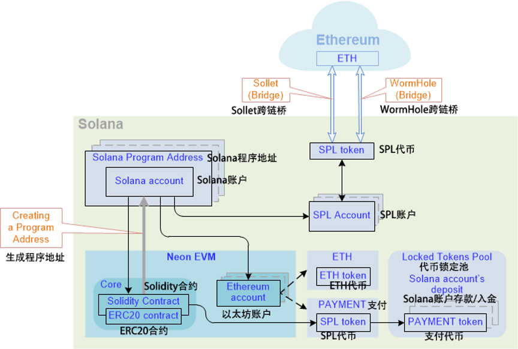

This section contains introductory information about the Transaction Value token (hereinafter Value token), which is analogous to the ETH token in Neon EVM solutions.

本章包含有关交易价值代币(简称：价值代币)的基础信息，类似于 Neon EVM 解决方案中的 ETH 代币。

Using the original ETH token in Neon EVM can create additional difficulties when calculating payment of rewards to transaction participants. Therefore, the Value token is introduced to circulate inside Neon EVM. This token is analogous to ETH, coming from the Ethereum network through one of the bridges: WormHole or Sollet. Each of these bridges transfers funds (assets) from ETH-token to SPL-token and back.

在Neon EVM中，如果在计算支付给交易参与者的奖励时使用原始 ETH 代币，那就可能会产生额外的困难。因此，引价值代币就被引入并且在 Neon EVM 内部流通。该代币类似于 ETH，通过虫洞或 Sollet其中一个跨链桥从以太坊而来。每一个这样的跨链桥都将资金(资产)在 ETH 代币和SPL 代币之间互相转换。

Transfer of funds using bridges is automated, so the converted tokens are directly transferred to Neon EVM. The token conversion scheme is implemented in such a way that it allows transactions to be executed in parallel. Unlike the method of conversion through ERC20 tokens (this method is used in Ethereum, where a map is used with accounts inside a contract), this scheme does not allow transactions to line up in one queue.

使用跨链桥的来转移资金是自动化的，因此转换后的代币直接发送到 Neon EVM。代币转换方案以并行执行(交易)的方式实现。与通过 ERC20 代币进行转换的方法不同(这种方法在以太坊中使用，其合约内包含一个对应账户的映射)，该方案不允许交易在一个队列中排队。

  

### 在Neon EVM中存储余额(Storing balances inside Neon EVM)

Inside Neon EVM is the Ethereum account. For each user, the Ethereum account contains two fields for storing two types of coins:

Neon EVM 内部是以太坊帐户。对于每个用户，以太坊账户包含两个字段，用于存储两种类型的代币：

- `ETH (or USDT)`: a coin identifier, which is a Value token.  
  `ETH(或USDT)`：一个硬币标识符，它是一个价值代币。

- `PAYMENT`: a token to pay for transactions; each user can create a token, which they will pay with the operator for transactions.  
  `支付`：支付交易的代币；每个用户都可以创建一个代币，用此向运营者支付交易费用。

Part of the Ethereum account code should work with ETH and the other part with PAYMENT.

以太坊帐户代码的一部分应与 ETH 一起使用，另一部分与 PAYMENT 一起使用。

The Solana account is outside Neon EVM and is built as a program address of the Ethereum account. Therefore, only the Ethereum account can access the Solana account. The Solana account contains a balance in SPL tokens. All operations with a Value token are performed through an appeal to the SPL token. This balance is built in a certain fixed way according to the Ethereum account address and the Neon EVM program address. Therefore, only the Solana account can access this balance.

Solana 账户独立于 Neon EVM 之外，被构建为以太坊账户的程序地址。因此，只有以太坊账户可以访问 Solana 账户。 Solana 账户包含 SPL 代币余额。所有使用价值代币的操作都要通过对 SPL 代币的请求来执行。这个余额是根据以太坊账户地址和 Neon EVM 程序地址以某种固定的方式建立起来的。因此，只有 Solana 账户可以访问此余额。

Since only a specific Ethereum account can access the Solana account, only this Ethereum account can also access the Solana account balance.

由于只有特定的以太坊账户可以访问 Solana 账户，因此也只有这个以太坊账户可以访问 Solana 账户余额。

When funds are transferred between users, an SPL token is requested, and it transfers funds from one balance to another. Users' balances are stored in their accounts. This placement of balances eliminates the appearance of a queue for processing transactions.

当资金在用户间转移时，必须要(通过)一个 SPL 代币，并将资金从一个余额转移到另一个余额。用户的余额存储在他们的帐户中。这种余额放置消除了(处理)交易队列。

Neon EVM contains the ERC20 contract. This contract works with the balances of Solana's accounts (the ERC20 contract is called from inside the Solidity contract).

Neon EVM 包含 ERC20 合约。该合约使用 Solana 账户的余额(ERC20 合约从 Solidity 合约内部调用)。

### 创建一个以太坊账号(Creating an Ethereum account)

As soon as an Ethereum account is created, an SPL token balance is automatically built for a specific user. This operation can only be done by Neon EVM since only it has authorization to perform an operation from the program-account address (Solana account).

一旦创建了以太坊账户，就会自动为特定用户建立 SPL 代币余额。此操作只能由 Neon EVM 完成，因为只有它有权从程序帐户地址(Solana 帐户)执行操作。

After the Ethereum account is created, it becomes possible to send a Value token to the contract to a user's balance to process transfers made from the contract code.

创建以太坊帐户后，可以将价值代币发送到合约用户的余额中，来处理从合约代码发起的转账。

### 为执行交易付款(Payment for execution of a transaction)

A user has the ability to choose the token in which they will pay an operator for completing a transaction. To do this, the user creates an account in Neon EVM, where he can transfer ETH tokens through a bridge to pay for transactions. They automatically get a balance in the SPL token.

用户有能力选择以何种支付给运营方何种代币来完成交易。为此，用户在 Neon EVM 中创建一个帐户，他可以在其中通过跨链桥转移 ETH 代币来支付交易费用。他们会自动获得 SPL 代币的余额。

>_Transferring ETH (or USDT) tokens through one bridge (for example, through WormHole) will not be equivalent to transferring the same tokens through another bridge (for example, through Sollet). This means that the user cannot withdraw ETH tokens from their balance through one bridge (WormHole), if these tokens were transferred to this balance through another bridge (Sollet)._  
>
>_通过A跨链桥(比如通过虫洞)转移 ETH(或 USDT)代币并不等同于通过B跨链桥(例如，通过 Sollet)转移相同的代币。这意味着如果这些代币通过B跨链桥 (Sollet) 转移到该余额中，则用户无法通过A跨链桥 (虫洞) 从其余额中提取 ETH 代币。_

Since a coroutine address is linked to the user's balance, no one except this coroutine address can use this token.

由于一个协同地址与用户的余额挂钩，所以除了这个协同地址之外，没有人可以使用这个代币。

#### 代币流通(Token circulation)

Depending on the number of operations in a transaction, it can be performed in one or several iterations. When a user creates a transaction, they specify the cost of its execution, taking into account gas price. For each iteration performed separately, funds are transferred to an operator from the specified total transaction cost. Neon EVM acts as a guarantor in payment of funds to the operator for each iteration performed by them in accordance with the gas price.

根据交易中操作的数量，(流动)可以在一次或多次迭代中执行。当用户创建交易时，他们会考虑 gas 价格并指明执行成本。对于单独执行的每次迭代，资金从指定的总交易成本转移到运营方。Neon EVM 充当担保人，为运营方根据 gas 价格执行的每次迭代付费。

**单次迭代中交易执行的代币流转(Token circulation for transaction execution in one iteration)**

Before executing a transaction, an operator transfers funds to the Neon token collateral pool. At the same time, they pay a fee to the validator for checking signatures and pays rent for storing data on the balance of the account.

在执行交易之前，运营方将资金转移到 Neon 代币抵押池。同时，他们向验证者支付检查签名的费用，并支付用于在账户余额中存储数据的租金。

After the transaction is completed, `PAYMENT` tokens are transferred from the user's balance to the operator's balance to cover the costs.

交易完成后，`支付代币 (PAYMENT tokens)`从用户余额转移到运营方余额以支付费用。

**多次迭代中交易执行的代币流通(Token circulation for transaction execution in multiple iterations)**

Unlike a non-iterative transaction, the payment of funds to operators is added to make them more interested in facilitating faster transaction execution. This is done so that the accounts involved in the process are not blocked for an extended period of time.

与非迭代交易不同，向运营方支付资金是为了让他们更有兴趣促进交易更快执行。这样做是为了使该过程中涉及的帐户不会在很长一段时间内被封锁。

At the start of an iterative transaction, an operator transfers a fee to the collateral pool, as well as funds (SOL tokens) to a special deposit account. The funds in this account will be paid to the operator who completes the transaction. The fee will be paid for execution costs over multiple iterations.

在迭代交易开始时，运营方将一笔费用转入抵押池，并将资金(SOL 代币)转入特殊存款账户。账户中的资金将支付给完成交易的运营方。而费用将用来支付多次迭代的执行成本。

The priority to receive funds from a deposit is given to the operator who sent the transaction for execution.

发送交易执行的运营方将被授予从存款中接收资金的优先权。

A transaction contains the name of the operator that is executing it. Also, the transaction indicates the block number when the last activity of this operator was. If fewer blocks have passed than the hardcoded value of the blocks, then this operator can continue the transaction. Only the operator specified in it can cancel the transaction. If more blocks have passed, then any operator can continue the transaction. The right to execute the transaction passes to the operator that intercepts this execution, that is, who is ahead of the others.

交易包含正在执行它的运营方的名称。此外，该交易会表明该运营方最后一次活动的区块编号。如果通过的块少于块的硬编码值(固定编码值)，则该运营方可以继续交易。只有(交易中)指定的运营方才能取消交易。如果有更多的区块通过，那么任何运营方都可以继续交易。执行交易的权利传递给领先于其他人拦截这次执行的运营方。

The right to withdraw funds from a deposit is granted to the operator who performs the final step. At this step, the user's funds are transferred to the deposit.

从存款中提取资金的权利授予执行最后一步的运营方。在这一步，用户的资金被转入存款。

If for some reason a transaction is canceled (using the "Cancel" operation), the blocked funds of a user are returned to them. The deposit that was frozen is burned. No payout is made to operators. This is done so that operators are motivated to complete the transaction.

如果由于某种原因取消了交易(使用“取消”操作)，则将用户封锁的资金返还给他们。被冻结的存款被烧毁。不向运营方支付任何费用。这样做是为了激励运营方完成交易。